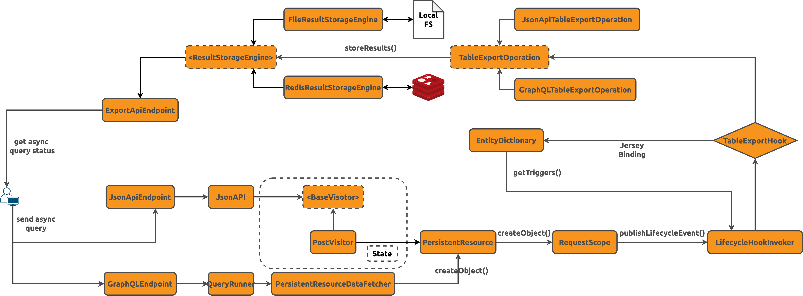

import Tabs from '@theme/Tabs';
import TabItem from '@theme/TabItem';

Overview
--------

Elide APIs are designed for synchronous request and response behavior. The time allowed to service a synchronous
response can be limited by proxy servers and gateways. Analytic queries can often take longer than these limits and
result in a server timeout. Elide's asynchronous API decouples the submission of a request and the delivery of the
response into separate client calls. Some of the features available are:

- Queries are run in a background thread that posts the results into a persistence store.
- Results can be retrieved as an embedded response or URL for downloading later.
- Supported downloading formats - CSV and JSON.
- Queries can be configured to execute synchronously before switching to asynchronous mode if not finished by a client
  provided threshold.
- Queries that are interrupted due to an application crash/reboot are automatically flagged as TIMEDOUT.
- Persisted queries and results are deleted after a configurable threshold.

Design
------

### API

The Async API supports two different query abstractions built using standard Elide models (AsyncQuery and TableExport):

- Any read-only API request in JSON-API or GraphQL can be submitted by creating an AsyncQuery object. After creation,
  the client can poll the AsyncQuery object asynchronously for status updates. Once complete, the AsyncQuery object
  stores the query result as an embedded attribute.
- For large response bodies, Elide supports a streaming abstraction called TableExport. It works similarly to the
  AsyncQuery model but with three important differences:

  1. TableExport can only be leveraged when:

     - The query is a simple read.
     - The model being queried has no relationships.
     - Only one model is being queried in the request.

  2. Upon successful completion, the TableExport model includes a separate URL attribute that references the query
     results for streaming downloads.
  3. The results of the GraphQL or JSON-API query are converted into a simple, flat JSON or CSV format.

Example API requests and responses can be found [here](asyncapi#running).

### Threading

Each Elide instance runs a scheduler that is responsible for executing these requests in background threads. New async
requests are initially marked in the QUEUED state. The requests are picked for execution as the threads become
available. Upon completion, the background thread posts the query status and results to a persistent store. The size of
the thread pool can be configured as mentioned [here](asyncapi#additional-configuration).

### Async After

The Async requests can be configured to execute synchronously before switching to asynchronous mode. The requests not
finished synchronously by the client provided threshold are handed off to a separate thread for posting the results once
complete. The default value for `async-after` is 10 seconds. Setting `async-after` to 0 will execute the request in
asynchronous mode upon submission.

### Background Cleaner

Each Elide instance will also run a scheduler for maintenance and cleanup.

- It cleans up requests and results stored in the persistent store.
- It scans and flags the queries that failed due to an application crash/reboot automatically as TIMEDOUT.
- It is responsible for the graceful cancellation of async requests.

  - The user can update the status of the async requests to CANCELLED. The cleaner polls the AsyncQuery and TableExport
    models to find any new requests that were CANCELLED and tries to terminate the transaction associated with that
    execution and change the status to CANCEL_COMPLETE.
  - Long-running transactions that exceed the run time threshold are terminated. Any background thread executing the
    original request is interrupted.

- The retention, polling interval, and max run time thresholds can be configured during application startup.
- This scheduler can be disabled by setting `cleanup.enabled` to false as mentioned
  [here](asyncapi#enable-the-async-api).

### TableExport Results Download

Elide has built-in support for streaming the results of a TableExport request through the export endpoint. Upon
successful completion, the TableExport model includes a separate URL attribute where results can be downloaded from.

Enabling the end-point, timeouts, path, download attachment extensions, etc. can be configured during application
startup as mentioned [here](asyncapi#additional-configuration).

### Supported Query Types

Below are the supported values for query type in asynchronous calls:

* GRAPHQL_V1_0
* JSONAPI_V1_0

### Supported Result Types

Elide can transform the results into a pre-selected format while persisting them via the
[ResultStorageEngine](asyncapi#overriding-the-resultstorageengine). Below are the supported formats for Table Export
results:

- JSON
- CSV

### Query Status

Below are the different states of an asynchronous request:

| Status          | Description                                                                           |
| --------------- | ------------------------------------------------------------------------------------- |
| QUEUED          | Request is submitted and waiting to be picked up for execution.                       |
| PROCESSING      | Request has been picked up for execution.                                             |
| COMPLETE        | Request has completed.                                                                |
| CANCELLED       | The client has requested to cancel a running request.                                 |
| TIMEDOUT        | Request did not finish within the configured maximum run time.                        |
| FAILURE         | Request not completed due to one or more failures encountered by the scheduler.       |
| CANCEL_COMPLETE | Request has been canceled by the background cleaner.                                  |

Malformed or invalid queries provided in the Async request will finish with COMPLETE status and the actual error message
will be available in the `result` property of AsyncQuery and TableExport models.

Security
--------

The Async API models (AsyncQuery and TableExport) have a simple permission model: Only the principal who submitted a
query and principals which belong to an administrative role are allowed to retrieve its status or results. Principals
can be assigned roles when constructing the Elide [user](security#user) object.

Enable the Async API
--------------------

By default the async API is disabled. The elide models (AsyncQuery and TableExport) needed to support the Async API are
JPA [models][demo-schema] that are mapped to a specific database schema. This schema must be created in our target
database. Feel free to modify the query/result column sizes if needed.

| Name                              | Description                                                                                                                | Default    |
| ----------------------------------|----------------------------------------------------------------------------------------------------------------------------| -----------|
| `elide.async.enabled`             | Enable the Async API feature.                                                                                              | `false`    |
| `elide.async.cleanup.enabled`     | Enable cleaning up of Async API requests history, update the status of interrupted/timedout requests, and cancel requests. | `false`    |

<Tabs>
  <TabItem value="Spring" label="Spring" default>

  Configure in `application.yaml`.

  If we rely on Spring to autodiscover the entities which are placed in the same package/sub-package as the application
  class with `@SpringBootApplication` annotation, we will have to add the `@EntityScan` annotation to that application
  class for those entities to be discovered after async is enabled.

  ```yaml
  elide:
    async:
      enabled: true
      cleanup:
        enabled: true
  ```

  </TabItem>
  <TabItem value="Elide Standalone" label="Elide Standalone">

  Override `ElideStandaloneSettings`.

  ```java
  public abstract class Settings implements ElideStandaloneSettings {
      @Override
      public ElideStandaloneAsyncSettings getAsyncProperties() {
          ElideStandaloneAsyncSettings asyncProperties = new ElideStandaloneAsyncSettings() {
              @Override
              public boolean enabled() {
                  return true;
              }
  
              @Override
              public boolean enableCleanup() {
                  return true;
              }
          }
          return asyncProperties;
      }
  }
  ```

  </TabItem>
</Tabs>

### Additional Configuration

These additional configuration settings control timeouts, cleanup, export end-point, resultStorageEngine and the sizes of thread pools.

| Name                                              | Description                                                                                                             | Default Value
|---------------------------------------------------|-------------------------------------------------------------------------------------------------------------------------|---------------
| `elide.async.enabled`                             | Whether or not the async feature is enabled.                                                                            | `false`
| `elide.async.thread-pool-size`                    | Default thread pool size.                                                                                               | `5` 
| `elide.async.max-async-after`                     | Default maximum permissible time to wait synchronously for the query to complete before switching to asynchronous mode. | `10s`
| `elide.async.cleanup.enabled`                     | Whether or not the cleanup is enabled.                                                                                  | `false`
| `elide.async.cleanup.query-max-run-time`          | Maximum query run time.                                                                                                 | `3600s`
| `elide.async.cleanup.query-retention-duration`    | Retention period of async query and results before being cleaned up.                                                    | `7d`
| `elide.async.cleanup.query-cancellation-interval` | Polling interval to identify async queries that should be canceled.                                                     | `300s`
| `elide.async.export.enabled`                      | Whether or not the controller is enabled.                                                                               | `false`
| `elide.async.export.path`                         | The URL path prefix for the controller.                                                                                 | `/export`
| `elide.async.export.append-file-extension`        | Enable Adding Extension to table export attachments.                                                                    | `false`
| `elide.async.export.storage-destination`          | Storage engine destination.                                                                                             | `/tmp`
| `elide.async.export.format.csv.write-header`      | Generates the header in a CSV formatted export.                                                                         | `true`

These additional configuration settings are only applicable for Elide’s Standalone module. When using Spring, please
configure the TaskExecutor used by Spring MVC for executing and managing the asynchronous requests.

| Name                          | Description                                                                   | Default Value                                   
|-------------------------------|-------------------------------------------------------------------------------|-------------------------------------------------
| `exportAsyncResponseTimeout`  | Default timeout for TableExport's result download end-point.                  | `30s`                                           |
| `exportAsyncResponseExecutor` | Executor for executing TableExport's result download request asynchronously.  | A java.util.concurrent.ExecutorService instance |

<Tabs>
  <TabItem value="Spring" label="Spring" default>

  Configure in `application.yaml`.

  ```yaml
  elide:
    async:
      thread-pool-size: 10
      max-async-after: 30s
      cleanup:
        enabled: true
          query-max-run-time: 120s
          query-retention-duration: 10d
          query-cancellation-check-interval: 600s
      export:
        enabled: true
        path: /export
        storage-destination: /tmp
        format:
          csv:
            write-header: true
  ```

  </TabItem>
  <TabItem value="Elide Standalone" label="Elide Standalone">

  Override `ElideStandaloneSettings`.

  ```java
  public abstract class Settings implements ElideStandaloneSettings {
      @Override
      public ElideStandaloneAsyncSettings getAsyncProperties() {
          ElideStandaloneAsyncSettings asyncProperties = new ElideStandaloneAsyncSettings() {
              @Override
              public Integer getThreadSize() {
                  return 10;
              }
  
              @Override
              public Duration getQueryMaxRunTime() {
                  return Duration.ofSeconds(120L);
              }
  
              @Override
              public Duration getQueryRetentionDuration() {
                  return Duration.ofDays(10L);
              }
  
              @Override
              public Duration getQueryCancellationCheckInterval() {
                  return Duration.ofSeconds(600L);
              }
  
              @Override
              public Duration getMaxAsyncAfter() {
                  return Duration.ofSeconds(30L);
              }
  
              @Override
              public String getExportApiPathSpec() {
                  return "/export/*";
              }
  
              @Override
              boolean enableExport() {
                  return false;
              }
  
              @Override
              public boolean appendFileExtension() {
                  return true;
              }
  
              @Override
              public boolean csvWriteHeader() {
                  return false;
              }
  
              @Override
              public String getStorageDestination() {
                  return "/tmp";
              }
  
              @Override
              public Duration getExportAsyncResponseTimeout() {
                  return Duration.ofSeconds(30L);
              }
  
              @Override
              public ExecutorService getExportAsyncResponseExecutor() {
                  return enableExport() ? Executors.newFixedThreadPool(getThreadSize() == null ? 6 : getThreadSize()) : null;
              }
          }
          return asyncProperties;
      }
  }
  ```

  </TabItem>
</Tabs>

### Running

After configuring and starting our service, the following commands illustrate how to make asynchronous requests. Don't
forget to change `localhost:8080` accordingly. The example below makes use of the models and sample data that the
liquibase migrations added through our example is [available here][elide-demo].

#### Submitting query

<Tabs>
  <TabItem value="asyncquery-json-api" label="AsyncQuery JSON-API" default>
    ```curl
    curl -X POST http://localhost:8080/api/v1/asyncQuery/ \
        -H"Content-Type: application/vnd.api+json" -H"Accept: application/vnd.api+json" \
        -d'{
                "data": {
                           "type": "asyncQuery",
                           "id": "ba31ca4e-ed8f-4be0-a0f3-12088fa9263d",
                           "attributes": {
                                           "query": "/group?sort=commonName&fields%5Bgroup%5D=commonName,description",
                                           "queryType": "JSONAPI_V1_0",
                                           "status": "QUEUED"
                                         }
                        }
            }'
    ```
  </TabItem>
  <TabItem value="asyncquery-graphql" label="AsyncQuery GraphQL">
    ```curl
    curl -g -X POST -H"Content-Type: application/json" \
        -H"Accept: application/json" "http://localhost:8080/graphql/api/v1" \
        -d'{
                "query" : "mutation { asyncQuery(op: UPSERT, data: {id: \"bb31ca4e-ed8f-4be0-a0f3-12088fb9263e\", query: \"{\\\"query\\\":\\\"{ group { edges { node { name } } } }\\\",\\\"variables\\\":null}\", queryType: GRAPHQL_V1_0, status: QUEUED}) { edges { node { id query queryType status result {completedOn responseBody contentLength httpStatus recordCount} } } } }"
           }'
    ```
  </TabItem>
  <TabItem value="tableexport-json-api" label="TableExport JSON-API">
    ```curl
    curl -X POST http://localhost:8080/api/v1/tableExport/ \
        -H"Content-Type: application/vnd.api+json" -H"Accept: application/vnd.api+json" \
        -d'{
                "data": {
                           "type": "tableExport",
                           "id": "ba31ca4e-ed8f-4be0-a0f3-12088fa9263f",
                           "attributes": {
                                           "query": "/group?sort=commonName&fields%5Bgroup%5D=commonName,description",
                                           "queryType": "JSONAPI_V1_0",
                                           "status": "QUEUED",
                                           "resultType": "CSV"
                                         }
                        }
            }'
    ```
  </TabItem>
  <TabItem value="tableexport-graphql" label="TableExport GraphQL">
    ```curl
    curl -g -X POST -H"Content-Type: application/json" \
        -H"Accept: application/json" "http://localhost:8080/graphql/api/v1" \
        -d'{
                "query" : "mutation { tableExport(op: UPSERT, data: {id: \"bb31ca4e-ed8f-4be0-a0f3-12088fb9263g\", query: \"{\\\"query\\\":\\\"{ group { edges { node { name } } } }\\\",\\\"variables\\\":null}\", queryType: GRAPHQL_V1_0, resultType: CSV, status: QUEUED}) { edges { node { id query queryType resultType status result {completedOn url message httpStatus recordCount} } } } }"
           }'
    ```
  </TabItem>
</Tabs>

Here are the respective responses:

<Tabs>
  <TabItem value="asyncquery-json-api" label="AsyncQuery JSON-API" default>
    ```json
    {
        "data":{
            "type":"asyncQuery",
            "id":"ba31ca4e-ed8f-4be0-a0f3-12088fa9263d",
            "attributes":{
                "asyncAfterSeconds":10,
                "principalName":null,
                "createdOn":"2020-04-08T23:29Z",
                "query":"/group?sort=commonName&fields%5Bgroup%5D=commonName,description",
                "queryType":"JSONAPI_V1_0",
                "status":"COMPLETE",
                "updatedOn":"2020-04-08T23:29Z",
                "result":{
                    "recordCount":2,
                    "httpStatus":200,
                    "completedOn":"2020-04-08T23:29Z",
                    "contentLength":282,
                    "responseBody":"{\"data\":[{\"type\":\"group\",\"id\":\"com.paiondata.elide\",\"attributes\":{\"commonName\":\"Elide\",\"description\":\"The magical library powering this project\"}},{\"type\":\"group\",\"id\":\"com.example.repository\",\"attributes\":{\"commonName\":\"Example Repository\",\"description\":\"The code for this project\"}}]}"
                }
            }
        }
    }
    ```
  </TabItem>
  <TabItem value="asyncquery-graphql" label="AsyncQuery GraphQL">
    ```json
    {
        "data":{
            "asyncQuery":{
                "edges":[
                    {
                        "node":{
                            "id":"bb31ca4e-ed8f-4be0-a0f3-12088fb9263e",
                            "query":"{\"query\":\"{ group { edges { node { name } } } }\",\"variables\":null}",
                            "queryType":"GRAPHQL_V1_0",
                            "status":"COMPLETE",
                            "result":{
                                "completedOn":"2020-04-08T21:25Z",
                                "responseBody":"{\"data\":{\"group\":{\"edges\":[{\"node\":{\"name\":\"com.example.repository\"}},{\"node\":{\"name\":\"com.paiondata.elide\"}},{\"node\":{\"name\":\"elide-demo\"}}]}}}",
                                "contentLength":109,
                                "httpStatus":200,
                                "recordCount":2
                            }
                        }
                    }
                ]
            }
        }
    }
    ```
  </TabItem>
  <TabItem value="tableexport-json-api" label="TableExport JSON-API">
    ```json
    {
        "data":{
            "type":"tableExport",
            "id":"ba31ca4e-ed8f-4be0-a0f3-12088fa9263f",
            "attributes":{
                "asyncAfterSeconds":10,
                "principalName":null,
                "createdOn":"2020-04-08T23:29Z",
                "query":"/group?sort=commonName&fields%5Bgroup%5D=commonName,description",
                "queryType":"JSONAPI_V1_0",
                "resultType":"CSV",
                "status":"COMPLETE",
                "updatedOn":"2020-04-08T23:29Z",
                "result":{
                    "recordCount":2,
                    "httpStatus":200,
                    "completedOn":"2020-04-08T23:29Z",
                    "url":"http://localhost:8080/export/ba31ca4e-ed8f-4be0-a0f3-12088fa9263f",
                    "message":null
                }
            }
        }
    }
    ```
  </TabItem>
  <TabItem value="tableexport-graphql" label="TableExport GraphQL">
    ```json
    {
        "data":{
            "asyncQuery":{
                "edges":[
                    {
                        "node":{
                            "id":"bb31ca4e-ed8f-4be0-a0f3-12088fb9263g",
                            "query":"{\"query\":\"{ group { edges { node { name } } } }\",\"variables\":null}",
                            "queryType":"GRAPHQL_V1_0",
                            "resultType":"CSV",
                            "status":"COMPLETE",
                            "result":{
                                "completedOn":"2020-04-08T21:25Z",
                                "url":"http://localhost:8080/export/bb31ca4e-ed8f-4be0-a0f3-12088fb9263g",
                                "message":null,
                                "httpStatus":200,
                                "recordCount":2
                            }
                        }
                    }
                ]
            }
        }
    }
    ```
  </TabItem>
</Tabs>

### Retrieving status and result

Long-running queries in the QUEUED or PROCESSING state may not return with the `result` property populated in the
responses above. The client can poll the AsyncQuery and TableExport objects asynchronously for status updates.

<Tabs>
  <TabItem value="asyncquery-json-api" label="AsyncQuery JSON-API" default>
    ```curl
    curl -X GET http://localhost:8080/api/v1/asyncQuery/ba31ca4e-ed8f-4be0-a0f3-12088fa9263d \
        -H"Content-Type: application/vnd.api+json" -H"Accept: application/vnd.api+json"
    ```
  </TabItem>
  <TabItem value="asyncquery-graphql" label="AsyncQuery GraphQL">
    ```curl
    curl -g -X POST -H"Content-Type: application/json" -H"Accept: application/json" \
        "http://localhost:8080/graphql/api/v1" \
        -d'{
               "query" : "{ asyncQuery (ids: \"bb31ca4e-ed8f-4be0-a0f3-12088fb9263e\") { edges { node { id query queryType status result {completedOn responseBody contentLength httpStatus recordCount}} } } }"
          }'
    ```
  </TabItem>
  <TabItem value="tableexport-json-api" label="TableExport JSON-API">
    ```curl
    curl -X GET http://localhost:8080/api/v1/tableExport/ba31ca4e-ed8f-4be0-a0f3-12088fa9263f \
        -H"Content-Type: application/vnd.api+json" -H"Accept: application/vnd.api+json"
    ```
  </TabItem>
  <TabItem value="tableexport-graphql" label="TableExport GraphQL">
    ```curl
    curl -g -X POST -H"Content-Type: application/json" -H"Accept: application/json" \
        "http://localhost:8080/graphql/api/v1" \
        -d'{
               "query" : "{ tableExport (ids: \"bb31ca4e-ed8f-4be0-a0f3-12088fb9263g\") { edges { node { id query queryType resultType status result {completedOn url message httpStatus recordCount}} } } }"
          }'
    ```
  </TabItem>
</Tabs>

Here are the respective responses:

<Tabs>
  <TabItem value="asyncquery-json-api" label="AsyncQuery JSON-API" default>
    ```json
    {
        "data":{
            "type":"asyncQuery",
            "id":"ba31ca4e-ed8f-4be0-a0f3-12088fa9263d",
            "attributes":{
                "asyncAfterSeconds":10,
                "principalName":null,
                "createdOn":"2020-04-08T21:25Z",
                "query":"/group?sort=commonName&fields%5Bgroup%5D=commonName,description",
                "queryType":"JSONAPI_V1_0",
                "status":"COMPLETE",
                "updatedOn":"2020-04-08T21:25Z",
                "result":{
                    "recordCount":2,
                    "httpStatus":200,
                    "completedOn":"2020-04-08T23:29Z",
                    "contentLength":282,
                    "responseBody":"{\"data\":[{\"type\":\"group\",\"id\":\"com.paiondata.elide\",\"attributes\":{\"commonName\":\"Elide\",\"description\":\"The magical library powering this project\"}},{\"type\":\"group\",\"id\":\"com.example.repository\",\"attributes\":{\"commonName\":\"Example Repository\",\"description\":\"The code for this project\"}}]}"
                }
            }
        }
    }
    ```
  </TabItem>
  <TabItem value="asyncquery-graphql" label="AsyncQuery GraphQL">
    ```json
    {
        "data":{
            "asyncQuery":{
                "edges":[
                    {
                        "node":{
                            "id":"bb31ca4e-ed8f-4be0-a0f3-12088fb9263e",
                            "query":"{\"query\":\"{ group { edges { node { name } } } }\",\"variables\":null}",
                            "queryType":"GRAPHQL_V1_0",
                            "status":"COMPLETE",
                            "result":{
                                "completedOn":"2020-04-08T21:25Z",
                                "responseBody":"{\"data\":{\"group\":{\"edges\":[{\"node\":{\"name\":\"com.example.repository\"}},{\"node\":{\"name\":\"com.paiondata.elide\"}},{\"node\":{\"name\":\"elide-demo\"}}]}}}",
                                "contentLength":109,
                                "httpStatus":200,
                                "recordCount":2
                            }
                        }
                    }
                ]
            }
        }
    }
    ```
  </TabItem>
  <TabItem value="tableexport-json-api" label="TableExport JSON-API">
    ```json
    {
        "data":{
            "type":"tableExport",
            "id":"ba31ca4e-ed8f-4be0-a0f3-12088fa9263f",
            "attributes":{
                "asyncAfterSeconds":10,
                "principalName":null,
                "createdOn":"2020-04-08T21:25Z",
                "query":"/group?sort=commonName&fields%5Bgroup%5D=commonName,description",
                "queryType":"JSONAPI_V1_0",
                "resultType":"CSV",
                "status":"COMPLETE",
                "updatedOn":"2020-04-08T21:25Z",
                "result":{
                    "recordCount":2,
                    "httpStatus":200,
                    "completedOn":"2020-04-08T23:29Z",
                    "url":"http://localhost:8080/export/ba31ca4e-ed8f-4be0-a0f3-12088fa9263f",
                    "message":null
                }
            }
        }
    }
    ```
  </TabItem>
  <TabItem value="tableexport-graphql" label="TableExport GraphQL">
    ```json
    {
        "data":{
            "asyncQuery":{
                "edges":[
                    {
                        "node":{
                            "id":"bb31ca4e-ed8f-4be0-a0f3-12088fb9263e",
                            "query":"{\"query\":\"{ group { edges { node { name } } } }\",\"variables\":null}",
                            "queryType":"GRAPHQL_V1_0",
                            "resultType":"CSV",
                            "status":"COMPLETE",
                            "result":{
                                "completedOn":"2020-04-08T21:25Z",
                                "url":"http://localhost:8080/export/bb31ca4e-ed8f-4be0-a0f3-12088fb9263g",
                                "message":null,
                                "httpStatus":200,
                                "recordCount":2
                            }
                        }
                    }
                ]
            }
        }
    }
    ```
  </TabItem>
</Tabs>

### Downloading the TableExport results

The TableExport request will return a URL to download the results as shown in the example response below.

<Tabs>
  <TabItem value="table-export-result" label="TableExport Result" default>
    ```json
    {
        "result":{
            "completedOn":"2020-04-08T21:25Z",
            "url":"http://localhost:8080/export/bb31ca4e-ed8f-4be0-a0f3-12088fb9263g",
            "message":null,
            "httpStatus":200,
            "recordCount":2
        }
    }
    ```
  </TabItem>
  <TabItem value="json" label="JSON">
    ```json
    [
        {
            "commonName":"Elide",
            "description":"The magical library powering this project"
        },
        {
            "commonName":"Example Repository",
            "description":"The code for this project"
        }
    ]
    ```
  </TabItem>
  <TabItem value="csv" label="CSV">
    ```csv
    "commonName", "description"
    "Elide", "The magical library powering this project"
    "Example Repository", "The code for this project"
    ```
  </TabItem>
</Tabs>

Overriding the AsyncApiDao
--------------------------

The Async API interacts with the persistence layer through an abstraction - the AsyncApiDao, for status updates, query
cleanup, etc. This can be customized by providing our own implementation. Elide provides a default implementation of
[AsyncApiDao][default-async-api-dao].

<Tabs>
  <TabItem value="Spring" label="Spring" default>

  Create a `@Configuration` class that defines our custom implementation as a `@Bean`.

  ```java
  @Configuration
  public class ElideConfiguration {
      /**
       * Configure the AsyncApiDao used by async requests.
       * @return an AsyncApiDao object.
       */
      @Bean
      public AsyncApiDao asyncApiDao() {
          return new CustomAsyncApiDao();
      }
  }
  ```

  </TabItem>
  <TabItem value="Elide Standalone" label="Elide Standalone">

  Override ElideStandaloneSettings.

  ```java
  public abstract class Settings implements ElideStandaloneSettings {
      @Override
      public ElideStandaloneAsyncSettings getAsyncProperties() {
          ElideStandaloneAsyncSettings asyncProperties = new ElideStandaloneAsyncSettings() {
              /**
               * Implementation of AsyncApiDao to use.
               * @return AsyncApiDao type object.
               */
              @Override
              public AsyncApiDao getAsyncApiDao() {
                  return new CustomAsyncApiDao();
              }
          }
          return asyncProperties;
      }
  }
  ```

  </TabItem>
</Tabs>

Overriding the ResultStorageEngine
----------------------------------

Table exports leverage a reactive abstraction (ResultStorageEngine) for streaming results to and from a persistence
backend. This can be customized by providing our own implementation. Elide provides default implementation of
[ResultStorageEngine][file-result-storage-engine].

<Tabs>
  <TabItem value="Spring" label="Spring" default>

  Create a `@Configuration` class that defines our custom implementation as a `@Bean`.

  ```java
  @Configuration
  public class ElideConfiguration {
      /**
       * Configure the ResultStorageEngine used by TableExport requests.
       * @return a ResultStorageEngine object.
       */
      @Bean
      public ResultStorageEngine resultStorageEngine() {
          return new CustomResultStorageEngine();
      }
  }
  ```

  </TabItem>
  <TabItem value="Elide Standalone" label="Elide Standalone">

  Override ElideStandaloneSettings.

  ```java
  public abstract class Settings implements ElideStandaloneSettings {
      @Override
      public ElideStandaloneAsyncSettings getAsyncProperties() {
          ElideStandaloneAsyncSettings asyncProperties = new ElideStandaloneAsyncSettings() {
              /**
               * Implementation of ResultStorageEngine to use.
               * @return ResultStorageEngine type object.
               */
              @Override
              public ResultStorageEngine getResultStorageEngine() {
                  return new CustomResultStorageEngine();
              }
          }
          return asyncProperties;
      }
  }
  ```

  </TabItem>
</Tabs>

Internals
---------



[demo-schema]: asyncapi#enable-the-async-api
[file-result-storage-engine]: https://github.com/paion-data/elide/blob/master/elide-async/src/main/java/com/paiondata/elide/async/service/storageengine/FileResultStorageEngine.java
[default-async-api-dao]: https://github.com/paion-data/elide/blob/master/elide-async/src/main/java/com/paiondata/elide/async/service/dao/DefaultAsyncApiDao.java
[elide-demo]: asyncapi#running
