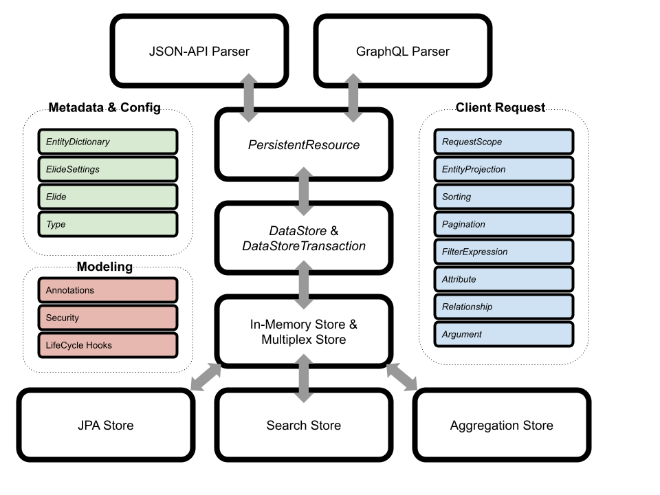

Overview
--------

The following guide is intended for developers who want to make changes to the Elide framework. It will cover the design
of various subsystems.

Module Layout
-------------

Elide is a mono-repo consisting of the following published modules:

| Module Name                     | Description                                                                      |
|---------------------------------|----------------------------------------------------------------------------------|
| elide-core                      | Contains modeling annotations, JSON-API parser, and core functions.              |
| elide-graphql                   | Contains the GraphQL parser.                                                     |
| elide-async                     | Contains Elide's asynchronous and data export APIs.                              |
| elide-swagger                   | Contains OpenAPI document generation for JSON-API.                               |
| elide-standalone                | Opinionated embedded Jetty application with JAX-RS endpoints for Elide           |
| elide-spring                    | Parent module for spring boot support                                            |
| elide-spring-boot-autoconfigure | Elide spring boot auto configuration module                                      |
| elide-spring-boot-starter       | Elide spring boot starter pom                                                    |
| elide-test                      | JSON-API and GraphQL test DSLs for [Rest Assured Testing Framework](https://rest-assured.io/) |
| elide-integration-tests         | Integration tests that are run for JPA, Hibernate, and In-Memory data stores.    |
| elide-model-config              | HJSON Configuration language for the Aggregation store semantic layer.           |
| elide-datastore                 | Parent module for all data stores.                                               |
| elide-datastore-aggregation     | Datastore and semantic layer for processing analytic API queries.                |
| elide-datastore-hibernate       | Parent package for all hibernate and JPA stores.                                 |
| elide-datastore-hibernate3      | Legacy data store for Hibernate 3 support.                                       |
| elide-datastore-hibernate5      | Legacy data store for Hibernate 5 support.                                       |
| elide-datastore-jpa             | Primary data store for elide CRUD API queries.  Replaces legacy hibernate stores. |
| elide-datastore-mulitplex       | Support for multiple data stores.                                                |
| elide-datastore-noop            | Zero persistence store.  This is used for implementing simple POST functions.    |
| elide-datastore-search          | Indexed text search store.  It must be used in conjunction with the JPA store.           |
| elide-datastore-inmemorydb      | Hashmap implementation of a datastore.                                           |

High Level Design
-----------------

The following diagram represents a high level component breakout of Elide. Names in italics represent class names
whereas other names represent functional blocks (made up of many classes).  Gray arrows represent client request and
response flow through the system.

Elide can be broken down into the following layers:

### Parsing Layer

The parsing layer consists of a JSON-API parser and GraphQL parser.  This layer is responsible for mapping a client
request in JSON-API or GraphQL into [Elide's internal request model](#client-request-model). The parsers load, create,
and manipulate Elide models via the `PersistentResource`.

### Business Logic Layer

The business logic layer is responsible for performing:

- Authorization checks
- Lifecycle hooks
- Audit & Logging

All elide models (once loaded or created) are wrapped in a `PersistentResource`.  All attribute and relationship access
(read & write) occur through this abstraction allowing a central place to enforce business rules.

In addition to invoking security checks and lifecycle hooks, the `PersistentResource` is also responsible for reading
and writing the model and its fields to the persistence layer.

### Persistence Layer

The persistence layer consists of two abstractions and their concrete implementations:

- A `DataStore` which is responsible for telling Elide which models it manages and creating `DataStoreTransaction`
  objects.
- A `DataStoreTransaction` which is created per request and is responsible for saving, loading, and deleting Elide
  models. Each request's interactions with the persistence layer should occur atomically.

Elide comes bundled with a number of `DataStore` [implementations](datastores). The most notable are the JPA, Search,
and Aggregation stores.

### Client Request Model

The primary object in the client request model is the `EntityProjection`.  It represents the entire model graph
requested by the client.  The entity projection consists of `Attribute` objects (model fields), `Relationship` objects
(named entity projections), and also whether the projection should be filtered, sorted, or paginated. `Attribute`
objects can take `Argument` objects as parameters.

### Metadata and Configuration

Elide is configured either with Spring Boot or the Elide Standalone module. Application settings for Spring and
Standalone are mapped to an internal `ElideSettings` object that configures the Elide framework (denoted by the `Elide`
object).

All static metadata about Elide models is extracted at service boot and stored in the `EntityDictionary`. This class is
used throughout Elide whenever a model must be read from or written to by the `PersistentResource`.

While earlier versions of Elide represented models as JVM classes, Elide 5.x introduced its own `Type` system.  This
allows Elide to register and use dynamic models that are not JVM classes.

### Modeling

CRUD models in Elide are created from JVM classes whereas analytic models are created either from JVM classes or HJSON
configuration files.  In either case, Elide annotations are used to add the metadata Elide needs to perform persistence
and business rules. All Elide annotations are documented here

## Security Subsystem

Coming Soon.

## Analytic Query Subsystem

Coming Soon.
