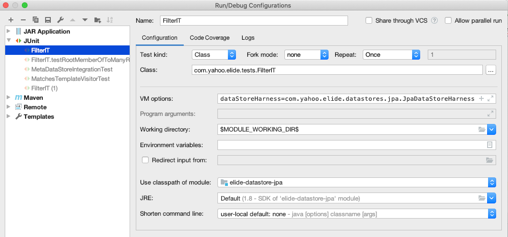

Overview
--------

The following guide is intended to help developers who maintain or want to make changes to the Elide framework.

### Building

Elide is built using maven.  Because elide is a mono-repo with interdependencies between modules, it is recommended to
fully build and install the project at least once:

```console
mvn clean install
```

Thereafter, individual modules can be built whenever making changes to them.  For example, the following command would
rebuild only elide-core:

```console
mvn clean install -f elide-core
```

Pull requests and release builds leverage [GitHub Actions](https://docs.github.com/en/actions). PR builds simply run the
complete build along with code coverage:

```console
mvn -B install -DrepoToken=${{ secrets.COVERALLS_REPO_TOKEN }}
```

### Release Versions

Elide follows [semantic versioning](https://semver.org/) for its releases. Minor and patch versions only have the
following version components:

`MAJOR.MINOR.PATCH`.

Integration Tests
-----------------

The `elide-integration-tests` module runs API tests against an embedded Jetty application with an H2 database for
persistence. Integration tests are run for the JPA, hibernate, and inmemory stores. The module produce a 'test-jar'
artifact that is then referenced for each data store module (jpa, hibernate, etc) that runs the corresponding tests.

Not every tests works for every store, and JUnit tags are leveraged to isolate the tests appropriate for each target.

When run in an IDE, the inmemory store is leveraged. To tests against a different data store, the IDE must be configured
to:

1. Set a property that selects the
   [DataStoreTestHarness](https://github.com/paion-data/elide/blob/master/elide-core/src/main/java/com/paiondata/elide/core/datastore/test/DataStoreTestHarness.java)
   which in turn initializes the data store to test.
2. Sets the classpath appropriately to the data store submodule that is being tested.

The following screenshot demonstrates configuring these two settings for the 'FilterIT' tests in IntelliJ:


