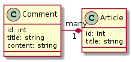

import Tabs from '@theme/Tabs';
import TabItem from '@theme/TabItem';

Core Concepts
-------------

API authentication is largely a solved problem and generally outside the scope of Elide. Authorization - the act of
verifying data and operation access for an _already authenticated user_ in the Elide framework involves a few core
concepts:

- **User** - Each API request is associated with a user principal. The user is opaque to the Elide framework but is
  passed to developer-defined _check_ functions that evaluate arbitrary logic or build filter expressions. More details
  can be found [here](#user).
- **Checks** - a function _or_ filter expression that grants or denies a user **permission** to perform a particular
  action.
- **Permissions** - a set of annotations (read, update, delete, create, and transfer) that correspond to actions on
  the data model's entities and fields. Each **permission** is decorated with one or more checks that are evaluated
  when a user attempts to perform that action.

Security Evaluation
-------------------

Security is applied hierarchically with three goals:

1. **Granting or denying access.** When a model or field is accessed, a set of checks are evaluated to determine if
   the access will be denied (i.e. 403 HTTP status code (JSON-API) or GraphQL error object) or permitted. If a user
   has explicitly requested access to part of the data model they should not see, the request will be rejected.
2. **Filtering Collections.** If a model has read permissions defined, these checks are evaluated against each model
   that is a member of the collection. Only the models the user has access to (by virtue of being able to read at
   least one of the model's fields) are returned in the response.
3. **Filtering a model.** If a user has read access to a model, but only for a subset of a model's fields, the
   disallowed fields are excluded from the output (rather than denying the request). However, when the user
   explicitly requests a field-set that contains a restricted field, the request is rejected rather than filtered.

### Hierarchical Security

Both JSON-API and GraphQL define mechanisms to fetch and manipulate entities defined by the data model schema. Some
(rootable) entities can be reached directly by providing their data type and unique identifier in the query. Other
entities can only be reached through relationships to other entities by traversing the entity relationship graph. The
Elide framework supports both methods of access. This is beneficial because it alleviates the need for all models to be
read-accessible at the root of the graph. When everything is exposed at the root, the developer needs to enumerate all
of the valid access patterns for all of the data models which can be unwieldy. In addition to eliminating redundancy in
security declaration, this form of security can have significant performance benefits for enforcing security on large
collections stored in key-value stores that have limited ability for the underlying persistence layer to directly apply
security filters. It is often possible to deny read access to an entire collection (i.e. hierarchical relationship)
before attempting to verify access to each individual member within that collection. Typically, security rules only need
to be defined for a subset of models and relationships - often near the roots of the graph. Applying security rules to
the relationships to prune the graph can eliminate invalid access patterns. To better understand the sequence of how
security is applied, consider the data model depicted in Figure below consisting of articles where each contains zero or
more comments.

<div align="center">  </div>

The request to update a specific comment of a particular article involves the following permission checks:

1. Read permission check on the Article's comments field.
2. Update permission check on the Comment's title field.

When a client modifies one side of a bidirectional relationship, Elide will automatically update the opposite side of
the relationship. This implies that the client must have permission to write both sides of the relationship.

Checks
------

Checks are simply functions that either return:

- whether or not access should be granted to the requesting user.
- a filter expression that can be used to filter a collection to what is visible to a given user.

Checks can either be invoked:

- immediately prior to the (create, read, update, and delete) action being performed. This is the default case.
- immediately before committing the transaction that wraps the entire API request. This is limited to checks on
  fields of newly created objects.

Elide supports three different concrete `Check` classes depending on what is being checked:


`Check` is the root interface of all three variants which are discussed next

### Operation Checks

Operation checks are inline checks whose evaluation requires the entity instance being read from or written to. They
operate in memory of the process running Elide.

Operation checks are expected to implement the following `Check` interface:

```java
/**
 * Determines whether the user can access the resource.
 *
 * @param object The object that is being read/written.
 * @param requestScope Request scope object
 * @param changeSpec Summary of modifications
 *
 * @return true if security check passed
 */
public abstract boolean ok(T object, RequestScope requestScope, Optional<ChangeSpec> changeSpec);
```

### User Checks

User checks depend strictly on the user principal. They only take a User object as input. Because these checks only
depend on who is performing the operation and not on what has changed, these checks are only evaluated once per
request - an optimization that accelerates the filtering of large collections.

User checks are expected to implement the following `Check` interface:

```java
/**
 * Method reserved for user checks.
 *
 * @param user User to check
 *
 * @return True if user check passes, false otherwise
 */
public abstract boolean ok(User user);
```

### Filter Expression Checks

In some cases, the check logic can be pushed down to the data store itself. For example, a filter can be added to a
database query to remove elements from a collection where access is disallowed. These checks return a
`FilterExpression` predicate that your data store can use to limit the queries that it uses to marshal the data.
Checks which extend the `FilterExpessionCheck` must conform to the interface:

```java
/**
 * Returns a FilterExpression from FilterExpressionCheck.
 *
 * @param entityClass entity type
 * @param requestScope Request scope object
 *
 * @return FilterExpression for FilterExpressionCheck.
 */
public abstract FilterExpression getFilterExpression(Type<?> entityClass, RequestScope requestScope);
```

`FilterExpressionCheck` _is_ an `OperationCheck`. If a security rule combines both an `OperationCheck` and
`FilterExpression` in a disjunction (logical OR), Elide will evaluate both in memory as operation checks.

Most `FilterExpressionCheck` functions construct a `FilterPredicate` which is a concrete implementation of the
`FilterExpression` interface:

```java
/**
 * Constructs a filter predicate.
 *
 * @param path The path through the entity relationship graph to a particular attribute to filter on.
 * @param op The filter comparison operator to evaluate.
 * @param values The list of values to compare the attribute against.
 */
public FilterPredicate(Path path, Operator op, List<Object> values) {

    ...
}
```

Here is an example to filter the Author model by book titles:

```java
// Construct a filter for the Author model for books.title == 'Harry Potter'
Path.PathElement authorPath = new Path.PathElement(Author.class, Book.class, "books");
Path.PathElement bookPath = new Path.PathElement(Book.class, String.class, "title");
List<Path.PathElement> pathList = Arrays.asList(authorPath, bookPath);
Path path = new Path(pathList);

return new FilterPredicate(path, Operator.IN, Collections.singletonList("Harry Potter"));
```

Filter expression checks are most important when a security rule is tied in some way to the data itself. By pushing
the security rule down to the datastore, the data can be more efficiently queried which vastly improves performance.
Moreover, this feature is critical for implementing a service that requires complex security rules (i.e. anything
more than role-based access) on large collections.

User
----

Each request is associated with a `User` object. The User is simply an object that wraps a
`java.security.Principal` object. It includes methods to:

1. Extract the user name.
2. Extract the underlying principal.
3. Check if the user belongs to a particular role.

### Spring Boot User Object

When using Spring Boot, the `User` object always wraps the `org.springframework.security.core.Authentication` extracted
by Spring Security.

### Elide Standalone User Object

When using elide standalone, the `User` objects wraps the Jakarta
[SecurityContext](https://qubitpi.github.io/jakartaee-rest/jaxrs-api/target/apidocs/jakarta.ws.rs/jakarta/ws/rs/core/SecurityContext.html)
-object.

The `SecurityContext` is created outside the Elide framework in a [JAX-RS](https://jcp.org/en/jsr/detail?id=311)
[ContainerRequestFilter](https://qubitpi.github.io/jakartaee-rest/jaxrs-api/target/apidocs/jakarta.ws.rs/jakarta/ws/rs/container/ContainerRequestFilter.html):

```java
@Override
public void filter(ContainerRequestContext containerRequestContext) throws IOException {
    containerRequestContext.setSecurityContext(new SecurityContext(){

        ...
    }
}
```

This filter will typically authenticate the request and store an identifier about the user inside the new
`SecurityContext`.

Permission Annotations
----------------------

The permission annotations include `ReadPermission`, `UpdatePermission`, `CreatePermission`, and `DeletePermission`
Permissions are annotations which can be applied to a model at the `package`, `entity`, or `field`-level. The most
specific annotation always take precedence (`package < entity < field`). More specifically, a field annotation
overrides the behavior of an entity annotation. An entity annotation overrides the behavior of a package annotation.
Entity annotations can be inherited from superclasses. When no annotation is provided at any level, access is
implicitly granted for `ReadPermission`, `UpdatePermission`, `CreatePermission`, and `DeletePermission`.

The permission annotations wrap a boolean expression composed of the check(s) to be evaluated combined with `AND`,
`OR`, and `NOT` operators and grouped using parenthesis. The checks are uniquely identified within the expression by
a string - typically a human readable phrase that describes the intent of the check (_"principal is admin at company
OR principal is super user with write permissions"_). These strings are mapped to the explicit `Check` classes at
runtime by registering them with Elide. When no registration is made, the checks can be identified by their fully
qualified class names. The complete expression grammar can be found [here][source-grammar].

To better understand how permissions work consider the following sample code. (Only the relevant portions are
included.)

<Tabs>
  <TabItem value="user" label="User.java" default>
    ```java
    @ReadPermission(expression = "Prefab.Role.All")
    @UpdatePermission(expression = "user is a superuser OR user is this user")
    @DeletePermission(expression = "user is a superuser OR user is this user")
    public class User {

        String name;

        @OneToMany(mappedBy = "author")
        Set<Post> posts;
    }
    ```
  </TabItem>
  <TabItem value="post" label="Post.java">
    ```java
    @ReadPermission(expression = "Post.isVisible OR user owns this post OR user is a superuser")
    @UpdatePermission(expression = "user owns this post")
    @CreatePermission(expression = "user owns this post")
    @DeletePermission(expression = "user owns this post")
    public class Post {

        @ManyToOne
        User author;

        @UpdatePermission(expression = "user owns this post OR user is a superuser")
        boolean published;

        @OneToMany(mappedBy = "post")
        Set<Comment> comments;
    }
    ```
  </TabItem>
  <TabItem value="comment" label="Comment.java">
    ```java
    // user has to be able to see the post and to see the comment, or else be a super user
    @ReadPermission(expression = "((Post.isVisible OR user owns this post) AND (comment is visible OR user made this comment)) OR user is a superuser")
    @UpdatePermission(expression = "user made this comment")
    @CreatePermission(expression = "post is visible")
    @DeletePermission(expression = "user made this comment")
    public class Comment {

        @ManyToOne
        User author;
        @ManyToOne
        Post post;
        @UpdatePermission(expression = "user owns this post OR user is a superuser")
        boolean suppressed;
    }
    ```
  </TabItem>
  <TabItem value="is-owner" label="IsOwner.java">
    ```java
    @SecurityCheck(IsOwner.PRINCIPAL_IS_OWNER)
    public static class IsOwner<Post> extends OperationCheck {

        public static final String PRINCIPAL_IS_OWNER = "user owns this post";

        @Override
        boolean ok(Post post, RequestScope requestScope, Optional<ChangeSpec> changeSpec) {
            return post.author.equals(requestScope.getUser());
        }
    }
    ```
  </TabItem>
  <TabItem value="is-superuser" label="IsSuperuser.java">
    ```java
    @SecurityCheck(IsSuperUser.PRINCIPAL_IS_SUPERUSER)
    public static class IsSuperuser extends UserCheck {

        public static final String PRINCIPAL_IS_SUPERUSER = "user is a superuser";

        @Override
        boolean ok(User user) {
            return user.isInRole("SUPER_USER");
        }
    }
    ```
  </TabItem>
</Tabs>

### Read

`ReadPermission` governs whether a model or field can be read by a particular user. If the expression evaluates to
`true` then access is granted. Notably, `ReadPermission` is evaluated as the user navigates through the entity
relationship graph. Elide's security model is focused on field-level access, with permission annotations applied on an
entity or package being shorthand for applying that same security to every field in that scope. For example, if a
request is made to `GET /users/1/posts/3/comments/99` the permission execution will be as follows:

1. `ReadPermission` on `User<1>#posts`
2. `ReadPermission` on `Post<3>#comments`
3. `ReadPermission` on any field on `Comment<99>`

If all of these checks succeed, then the response will succeed. The contents of the response are determined by
evaluating the `ReadPermission` on each field. The response will contain the subset of fields where `ReadPermission` is
granted. If a field does not have an annotation, then access defaults to whatever is specified at the entity level. If
the entity does not have an annotation, access defaults to whatever is specified at the package. If the package does not
have an annotation, access defaults to granted.

### Update

`UpdatePermission` governs whether a model can be updated by a particular user. Update is invoked when an attribute's
value is changed or values are added to or removed from a relationship. Examples of operations that will evaluate
`UpdatePermission` given objects `Post` and `User` from the code snippets above:

- Changing the value of `Post.published` will evaluate `UpdatePermission` on `published`. Because more specific checks
  override less specific checks, the `UpdatePermission` on the entity `Post` will not be evaluated.
- Setting `Post.author = User` will evaluate `UpdatePermission` on `Post` since `author` does not have a more specific
  annotation. Because `author` is a bidirectional relationship, `UpdatePermission` will also be evaluated on the
  `User.posts` field.
- Removing `Post` from `User.posts` will trigger `UpdatePermission` on both the `Post` and `User` entities.
- Creating `Post` will _not_ trigger `UpdatePermission` checks on any fields that are initialized in the request.
  However, it will trigger `UpdatePermission` on any bidirectional relationship fields on preexisting objects.

### Create

`CreatePermission` governs whether a model can be created or a field can be initialized in a newly created model
instance. Whenever a model instance is newly created, initialized fields are evaluated against `CreatePermission` rather
than `UpdatePermission`.

### Delete

`DeletePermission` governs whether a model can be deleted.

### NonTransferable

`NonTransferable` governs whether an existing model instance (one created in a prior transaction) can be assigned to
another collection other than the one in which it was initially created. Basically, does a collection 'own' the model
instance in a private sense (composition) or can it be moved or referenced by other collections (aggregation).

Marking an object `NonTransferable` means that it is owned by its containing collections at object creation. It cannot
be moved or copied to another collection after creation. Excluding this annotation means that instances of the class can
be moved or copied to other collections _provided the user agent can read the object_ (`ReadPermission` is satisfied on
at least some of its fields).

Registering Checks in Elide
---------------------------

Once an Elide data model has been annotated with Permission annotations, the textual descriptions of the checks must be
tied to actual check classes and registered in Elide. This can be done in one of two ways:

1. Automatically by marking the `Check` classes with a `SecurityCheck` annotation. Elide Spring Boot and Standalone will
   automatically scan for `SecurityCheck` classes and bind them.
2. Manually by creating a `Map<String, Class<? extends Check>>` where they key is the description and the value is the
   Check class. This is then passed to the constructor of the `EntityDictionary`.

### Automatic Scanning

Elide will find our security checks in the classpath if they are tagged with the `SecurityCheck` annotation:

```java
@SecurityCheck(AdminCheck.USER_IS_ADMIN)
public class AdminCheck extends UserCheck {

    public static final String USER_IS_ADMIN = "User is Admin";

    @Override
    boolean ok(User user) {
       ...
    }
}
```

The `EntityDictionary` must be told to scan for checks (by calling `dictionary.scanForSecurityChecks`). This is done
automatically in elide spring boot and elide standalone at startup.

### Manual Registration

If not using Elide spring boot or standalone, we can register checks when creating the `Elide` instance:

```java
//Create the check mappings
Map<String, Class<? extends Check>> checkMappings = new HashMap<>();
checkMappings.put("User is an admin", AdminCheck.class);

//Bind them in the dictionary
EntityDictionary dictionary = new EntityDictionary(checkMappings, beanFactory::autowireBean);

//Create a data store
DataStore dataStore = ...

//Configure Elide settings
ElideSettingsBuilder builder = ElideSettings.builder()
    .dataStore(dataStore)
    .entityDictionary(dictionary)
    .settings(JsonApiSettings.builder()
        .joinFilterDialect(new RSQLFilterDialect(dictionary))
        .subqueryFilterDialect(new RSQLFilterDialect(dictionary)))
    .settings(GraphQLSettings.builder()
        .filterDialect(new RSQLFilterDialect(dictionary)))
    .serdes(serdes -> serdes.withISO8601Dates("yyyy-MM-dd'T'HH:mm'Z'", TimeZone.getTimeZone("UTC")))
    .auditLogger(new Slf4jLogger());

//Create the Elide instance
Elide elide = new Elide(builder.build());
```

[source-grammar]: https://github.com/paion-data/elide/blob/master/elide-core/src/main/antlr4/com/paiondata/elide/generated/parsers/Expression.g4
